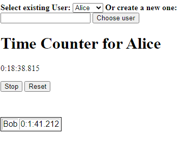
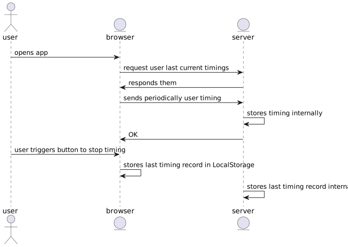
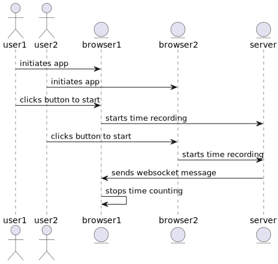

# MEETING TIMECOUNTER IN JAVASCRIPT



This is a simple meeting time counter running in every browser coded in Javascript. It's a proof of concept that demonstrates the use of fetch API and Websockets to a simple web server in Node.

## How to run
```
npm run start
```
Will launch the server and open http://localhost:3000 in a browser. 
`npm run browser` will just launcher the browser and `npm run server` just the local server.


```
@startuml
Actor user
Entity browser
Entity server
user -> browser : opens app
browser -> server: request user last current timings
server -> browser: responds them
browser -> server: sends periodically user timing
server -> server: stores timing internally
server-> browser: OK
user -> browser: user triggers button to stop timing
browser -> browser: stores last timing record in LocalStorage
server -> server : stores last timing record internally
@enduml
```


```
@startuml
Actor user1
Actor user2
Entity browser1
Entity browser2
Entity server
user1 -> browser1: initiates app
user2 -> browser2: initiates app
user1 -> browser1: clicks button to start
browser1 -> server: starts time recording
user2 -> browser2: clicks button to start
browser2 -> server: starts time recording
server -> browser1: sends websocket message
browser1 -> browser1: stops time counting
@enduml
```

